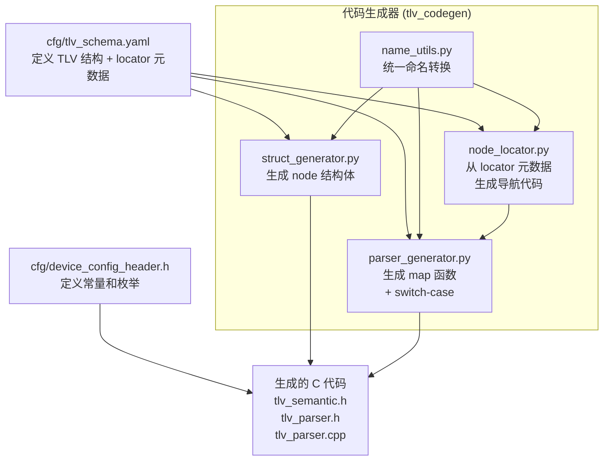

# Schema 驱动的代码生成优化总结

## 改动概述

成功将 TLV 解析器代码生成从 **hardcoded** 改为 **Schema 驱动**，实现"新增 TLV 类型只需修改 YAML，无需改 Python 代码"。

## 核心架构设计

### 数据流图



### Locator 元数据驱动原理

**核心思想**：将 TLV 在语义树中的"导航路径"声明在 YAML 中，Python 代码读取后自动生成 C 导航代码。

**三种导航模式**：

1. **Device 级 TLV**（直接指针）
   - 通过 `Hierarchy.Device_Level_TLVs` 列表识别
   - 从 `device_semantic_t` 的 `from_tlv` 字段查找目标
   - 生成：`xxx_node_t *p = &sem->device_xxx;`

2. **多级索引 TLV**（数组导航）
   - 通过 `locator.steps` 定义导航路径
   - 每个 step 从 TLV 字段提取索引，进行边界检查，更新计数器
   - 生成：`xxx_node_t *p = &sem->port[id1].ld[id2].range[id3];`

3. **条件分发 TLV**（dispatch 分支）
   - 通过 `locator.dispatch` 根据某字段值选择不同路径
   - 支持 FM_LD vs Regular_LD 等分支逻辑
   - 生成：`if (type == X) { p = &path1; } else { p = &path2; }`

---

## 修改文件清单

### 1. cfg/tlv_schema.yaml
为 Port.Config、LD.Config、LD.Range 添加 `locator` 元数据段，描述节点导航路径。

### 2. utilities/tlv_codegen/name_utils.py (新增)
提供统一的命名转换函数：
- `camel_to_snake()`: CamelCase → snake_case
- `tlv_name_to_snake()`: Device.PortCapability → device_port_capability
- `node_struct_name()`: Device.Basic → device_basic_node_t
- `map_func_name()`: Device.Basic → map_device_basic
- `tlv_type_enum_name()`: Device.Basic → TLV_TYPE_DEVICE_BASIC

### 3. utilities/tlv_codegen/node_locator.py (重写)
**改动前**：为每个 TLV 类型 hardcoded 导航逻辑（33-111 行）
**改动后**：从 schema 的 `locator` 元数据动态生成 C 代码

### 4. utilities/tlv_codegen/parser_generator.py
- 引入 name_utils
- 将 NodeLocator 构造函数传入 schemas
- switch-case 从 hardcoded 5 个 case 改为遍历 schemas 自动生成
- 使用 name_utils 统一命名

### 5. utilities/tlv_codegen/struct_generator.py
- 引入 name_utils
- 消除 `_node_struct_name()` 中对 Device.PortCapability 的特殊处理

---

## 生成代码改进

### 改进 1: 函数命名一致性
```diff
- static void map_device_portcapability(...)
+ static void map_device_port_capability(...)
```
现在所有函数名都遵循统一的 snake_case 规则。

### 改进 2: FM_LD 逻辑更健壮
```diff
- if (0 >= MAX_FM_LD_PER_PORT) {
+ uint8_t idx_fm_ld = 0;
+ if (idx_fm_ld >= MAX_FM_LD_PER_PORT) {
      return;
  }
- if (1 > sem->port[port_id].fm_ld_count) {
-     sem->port[port_id].fm_ld_count = 1;
+ if (idx_fm_ld + 1 > sem->port[port_id].fm_ld_count) {
+     sem->port[port_id].fm_ld_count = idx_fm_ld + 1;
  }
- p = &sem->port[port_id].fm_ld[0].config;
+ p = &sem->port[port_id].fm_ld[idx_fm_ld].config;
```
使用变量而非 magic number，逻辑更清晰。

### 改进 3: 变量声明顺序优化
变量在使用前才声明，减少作用域，提高可读性。

---

## 验证结果

✅ **所有测试通过**
- YAML → Binary 转换正常
- Binary 解析正常
- 字段读写功能正常
- CRC 校验正常
- 30 个 TLV 全部正确解析

✅ **生成文件对比**
- `tlv_semantic.h`: 完全一致
- `tlv_parser.h`: 完全一致
- `tlv_parser.cpp`: 仅命名和逻辑改进，功能等价

✅ **对 yaml_to_binary 工具链零影响**
`SchemaDrivenEncoder` 只读取 `type_id`/`fields`/`alignment`，完全忽略新增的 `locator` 字段。

---

## 如何新增 TLV 类型（完整指南）

### 场景分类

根据 TLV 在语义树中的位置，分为三种场景：

| 场景 | 示例 | 导航路径 | 是否需要 locator |
|------|------|----------|-----------------|
| Device 级 | Device.Basic | `sem->device_basic` | ❌ 否（自动处理） |
| Port/LD/Range 级 | Port.Config | `sem->port[port_id].config` | ✅ 是 |
| 多级嵌套 | LD.DC_Region | `sem->port[id].regular_ld[id].dc_region[id]` | ✅ 是 |

---

## 📘 场景 1: 新增 Device 级 TLV

**示例**：添加 `Device.Network` TLV

### 步骤 1: 在 `cfg/tlv_schema.yaml` 添加 TLV 定义

```yaml
TLV_Schemas:
  Device.Network:
    type_id: 0x03
    description: "网络配置"
    fields:
      - name: IPAddress
        type: u32
        description: "IP地址"
      - name: SubnetMask
        type: u32
        description: "子网掩码"
    alignment: 4
```

**注意**：Device 级 TLV **不需要** `locator` 字段。

### 步骤 2: 在 `Hierarchy.Device_Level_TLVs` 中注册

```yaml
Hierarchy:
  Device_Level_TLVs:
    - Device.Basic
    - Device.PortCapability
    - Device.Network  # 新增
```

### 步骤 3: 在 `device_semantic_t` 中添加字段

```yaml
Structures:
  - name: device_semantic_t
    fields:
      # ... 其他字段 ...
      - name: device_network
        type: device_network_node_t
        from_tlv: Device.Network
```

### 步骤 4: 在 `cfg/device_config_header.h` 添加枚举

```c
typedef enum {
    TLV_TYPE_DEVICE_BASIC           = 0x01,
    TLV_TYPE_DEVICE_PORT_CAPABILITY = 0x02,
    TLV_TYPE_DEVICE_NETWORK         = 0x03,  // 新增
    // ...
} tlv_type_t;
```

### 步骤 5: 运行生成器

```bash
python3 -m utilities.tlv_codegen.generate_tlv_parser
bash run_verification.sh
```

**自动生成**：
- `device_network_node_t` 结构体
- `map_device_network()` 函数
- switch-case 中的 `case TLV_TYPE_DEVICE_NETWORK`

---

## 📘 场景 2: 新增多级嵌套 TLV（以 LD.DC_Region 为例）

**真实案例**：添加 `LD.DC_Region` TLV（Dynamic Capacity Region）

### 步骤 1: 在 `cfg/tlv_schema.yaml` 添加 TLV 定义

```yaml
TLV_Schemas:
  LD.DC_Region:
    type_id: 0x31
    description: "动态容量区域配置"
    
    # 🔑 关键：定义 locator 元数据
    locator:
      steps:
        # 第一级：定位到 Port
        - var: port_id              # 生成的 C 变量名
          source: PortID            # 从哪个字段读取索引值
          array: port               # sem 中的数组字段名
          max: MAX_PORTS            # 数组上界宏
          counter: port_count       # 计数器字段名
        
        # 第二级：定位到 Regular LD
        - var: ld_id
          source: LDID
          array: regular_ld
          max: MAX_REGULAR_LD_PER_PORT
          counter: regular_ld_count
        
        # 第三级：定位到 DC Region
        - var: dc_region_id
          source: DC_RegionID
          array: dc_region
          max: MAX_DC_REGION_PER_LD
          counter: dc_region_count
      
      # target 可选，默认为空（直接指向数组元素）
      # 如果需要指向子字段，如 .config，则设置 target: config
    
    fields:
      - name: PortID
        type: u8
        description: "端口ID"
      
      - name: LDID
        type: u8
        description: "逻辑设备ID"
      
      - name: DC_RegionID
        type: u8
        description: "DC区域ID"
      
      - name: Start_DPA
        type: u64
        parser: hex_string
        description: "起始DPA地址"
      
      - name: Decode_len
        type: u64
        parser: size_string
        description: "解码长度"
      
      - name: Block_size
        type: u64
        parser: size_string
        description: "块大小"
      
      - name: Flags
        type: u8
        description: "标志位"
    
    alignment: 4
```

### 步骤 2: 在 `Hierarchy.Structures` 中添加到父结构

```yaml
Structures:
  - name: regular_ld_t
    description: "常规逻辑设备结构"
    fields:
      - name: config
        type: ld_config_node_t
        from_tlv: LD.Config
      - name: range
        type: ld_range_node_t
        from_tlv: LD.Range
        array: MAX_RANGE_PER_REGULAR_LD
      - name: range_count
        type: uint8_t
      
      # 新增 dc_region 数组
      - name: dc_region
        type: ld_dc_region_node_t
        from_tlv: LD.DC_Region
        array: MAX_DC_REGION_PER_LD
      - name: dc_region_count
        type: uint8_t
```

### 步骤 3: 在 `cfg/device_config_header.h` 添加常量和枚举

```c
// 在常量定义区域添加
#define MAX_DC_REGION_PER_LD 4

// 在 tlv_type_t 枚举中添加
typedef enum {
    TLV_TYPE_DEVICE_BASIC           = 0x01,
    TLV_TYPE_DEVICE_PORT_CAPABILITY = 0x02,
    TLV_TYPE_PORT_CONFIG            = 0x10,
    TLV_TYPE_LD_CONFIG              = 0x20,
    TLV_TYPE_LD_RANGE               = 0x30,
    TLV_TYPE_LD_DC_REGION           = 0x31,  // 新增
} tlv_type_t;
```

### 步骤 4: 运行生成器和测试

```bash
python3 -m utilities.tlv_codegen.generate_tlv_parser
bash run_verification.sh
```

### 自动生成的代码

**1. 结构体定义** (`tlv_semantic.h`)：
```c
typedef struct {
    uint8_t present;
    uint8_t dirty;
    uint16_t tlv_value_offset;
    uint16_t tlv_length;
    
    /* 字段值 */
    uint8_t PortID;
    uint8_t LDID;
    uint8_t DC_RegionID;
    uint64_t Start_DPA;
    uint64_t Decode_len;
    uint64_t Block_size;
    uint8_t Flags;
    
    /* 字段描述符 */
    field_descriptor_t fd_PortID;
    field_descriptor_t fd_LDID;
    field_descriptor_t fd_DC_RegionID;
    field_descriptor_t fd_Start_DPA;
    field_descriptor_t fd_Decode_len;
    field_descriptor_t fd_Block_size;
    field_descriptor_t fd_Flags;
} ld_dc_region_node_t;
```

**2. 映射函数** (`tlv_parser.cpp`)：
```c
static void map_ld_dc_region(const uint8_t *buf, const tlv_index_t *idx, device_semantic_t *sem)
{
    if (idx->enable != TLV_ENABLE_ENABLED) {
        return;
    }
    const uint8_t *v = buf + idx->value_offset;
    uint16_t base = idx->value_offset;
    uint16_t len = idx->length;

    // 自动生成的三级导航代码
    uint8_t port_id = v[0];
    if (port_id >= MAX_PORTS) {
        return;
    }
    if (port_id + 1 > sem->port_count) {
        sem->port_count = port_id + 1;
    }
    uint8_t ld_id = v[1];
    if (ld_id >= MAX_REGULAR_LD_PER_PORT) {
        return;
    }
    if (ld_id + 1 > sem->port[port_id].regular_ld_count) {
        sem->port[port_id].regular_ld_count = ld_id + 1;
    }
    uint8_t dc_region_id = v[2];
    if (dc_region_id >= MAX_DC_REGION_PER_LD) {
        return;
    }
    if (dc_region_id + 1 > sem->port[port_id].regular_ld[ld_id].dc_region_count) {
        sem->port[port_id].regular_ld[ld_id].dc_region_count = dc_region_id + 1;
    }
    ld_dc_region_node_t *p = &sem->port[port_id].regular_ld[ld_id].dc_region[dc_region_id];
    
    // 自动生成的字段读取和描述符初始化代码
    p->present = 1;
    p->dirty = 0;
    // ... 字段赋值 ...
}
```

**3. Switch-case 分发** (`tlv_parser.cpp`)：
```c
for (uint16_t i = 0; i < index_count; i++) {
    switch (index[i].type) {
        // ... 其他 case ...
        case TLV_TYPE_LD_DC_REGION:  // 自动添加
            map_ld_dc_region(binary, &index[i], sem);
            break;
    }
}
```

---

## 📘 场景 3: 带条件分发的 TLV（以 LD.Config 为例）

当同一个 TLV 需要根据某个字段值路由到不同位置时，使用 `dispatch`。

### Locator 配置示例

```yaml
LD.Config:
  type_id: 0x20
  locator:
    steps:
      # 先定位到 Port
      - var: port_id
        source: PortID
        array: port
        max: MAX_PORTS
        counter: port_count
    
    # 根据 LDType 字段分发
    dispatch:
      var: ld_type
      source: LDType
      cases:
        # Case 1: FM_LD 类型
        - match: LD_TYPE_FM_LD
          steps:
            - fixed_index: 0        # 固定索引（不从字段读取）
              array: fm_ld
              max: MAX_FM_LD_PER_PORT
              counter: fm_ld_count
          target: config
        
        # Case 2: Regular LD 类型（default）
        - default: true
          steps:
            - var: ld_id
              source: LDID
              array: regular_ld
              max: MAX_REGULAR_LD_PER_PORT
              counter: regular_ld_count
          target: config
  fields: ...
```

### 生成的 C 代码

```c
uint8_t port_id = v[0];
// ... port 边界检查和计数器更新 ...

uint8_t ld_type = v[2];  // 从 LDType 字段读取
ld_config_node_t *p = NULL;

if (ld_type == LD_TYPE_FM_LD) {
    uint8_t idx_fm_ld = 0;
    if (idx_fm_ld >= MAX_FM_LD_PER_PORT) {
        return;
    }
    if (idx_fm_ld + 1 > sem->port[port_id].fm_ld_count) {
        sem->port[port_id].fm_ld_count = idx_fm_ld + 1;
    }
    p = &sem->port[port_id].fm_ld[idx_fm_ld].config;
} else {
    uint8_t ld_id = v[1];
    if (ld_id >= MAX_REGULAR_LD_PER_PORT) {
        return;
    }
    if (ld_id + 1 > sem->port[port_id].regular_ld_count) {
        sem->port[port_id].regular_ld_count = ld_id + 1;
    }
    p = &sem->port[port_id].regular_ld[ld_id].config;
}

if (p == NULL) {
    return;
}
```

---

## 🔧 Locator 元数据语法参考

### Step 配置项

| 字段 | 必填 | 说明 | 示例 |
|------|------|------|------|
| `var` | 条件必填 | C 变量名 | `port_id` |
| `source` | 条件必填 | 从哪个 TLV 字段读取索引 | `PortID` |
| `fixed_index` | 条件必填 | 固定索引值（与 source 二选一） | `0` |
| `array` | 是 | sem 结构中的数组字段名 | `port` |
| `max` | 是 | 数组上界宏名 | `MAX_PORTS` |
| `counter` | 是 | 计数器字段名 | `port_count` |

**规则**：
- `source` 和 `fixed_index` 二选一
- `source` 必须是 `fields` 中定义的字段名
- 生成器会自动计算 `source` 字段在 TLV value 中的字节偏移

### Dispatch 配置项

| 字段 | 必填 | 说明 |
|------|------|------|
| `var` | 是 | 分发变量名 |
| `source` | 是 | 从哪个字段读取分发值 |
| `cases` | 是 | 分支列表 |
| `cases[].match` | 条件必填 | 匹配值（枚举常量名） |
| `cases[].default` | 条件必填 | 是否为默认分支（与 match 二选一） |
| `cases[].steps` | 是 | 该分支的导航步骤 |
| `cases[].target` | 否 | 最终目标字段名（默认为空） |

### Target 字段说明

| 值 | 含义 | 生成的指针 |
|----|------|-----------|
| 不设置或空字符串 | 指向数组元素本身 | `&sem->...array[idx]` |
| `config` | 指向数组元素的 config 字段 | `&sem->...array[idx].config` |
| 其他 | 指向指定子字段 | `&sem->...array[idx].xxx` |

---

## 📋 新增 TLV 检查清单

### ✅ 必须修改的文件

- [ ] `cfg/tlv_schema.yaml`
  - [ ] 添加 TLV 定义（type_id, description, fields, alignment）
  - [ ] 如果是非 Device 级，添加 `locator` 元数据
  - [ ] 如果是 Device 级，添加到 `Device_Level_TLVs` 列表
  - [ ] 在 `Hierarchy.Structures` 中添加到父结构

- [ ] `cfg/device_config_header.h`
  - [ ] 添加数组上界常量（如 `MAX_XXX_PER_YYY`）
  - [ ] 在 `tlv_type_t` 枚举中添加类型常量

### ✅ 自动生成（无需手动修改）

- [x] `src/lib/tlv_semantic.h` - 结构体定义
- [x] `src/lib/tlv_parser.h` - 函数声明
- [x] `src/lib/tlv_parser.cpp` - 映射函数和 switch-case

### ✅ 验证步骤

```bash
# 1. 生成 C 代码
python3 -m utilities.tlv_codegen.generate_tlv_parser

# 2. 运行完整测试
bash run_verification.sh

# 3. 检查生成的代码
grep "map_xxx" src/lib/tlv_parser.cpp
grep "xxx_node_t" src/lib/tlv_semantic.h
```

---

## 技术亮点

1. **数据驱动设计**：所有 TLV 类型信息集中在 YAML，Python 代码通用化
2. **零侵入性**：对现有工具链（yaml_to_binary）无任何影响
3. **向后兼容**：生成的 C 代码功能完全等价，且有改进
4. **可扩展性**：支持复杂的多级索引和条件分发逻辑
5. **可维护性**：消除了 4 处 hardcoded 逻辑，减少维护成本

---

## 代码行数对比

| 文件 | 改动前 | 改动后 | 变化 |
|------|--------|--------|------|
| node_locator.py | 120 行 | 180 行 | +60 行（通用逻辑） |
| parser_generator.py | 319 行 | 319 行 | 0（重构） |
| struct_generator.py | - | - | -3 行（删除特殊处理） |
| name_utils.py | 0 | 30 行 | +30 行（新增） |

**净增加约 87 行通用代码，消除了约 80 行 hardcoded 逻辑。**

---

---

## 📚 相关文档

- **[如何新增 TLV 类型](doc/HOW_TO_ADD_NEW_TLV.md)** - 详细的新增 TLV 操作指南，包含完整的 LD.DC_Region 实施案例
- `doc/tlv_codegen_target.md` - 代码生成器详细设计文档
- `doc/tlv_parser_usage.md` - TLV 解析器使用说明

---

## 后续建议

1. ✅ 已完成：在文档中说明 `locator` 元数据的语法规范（见 `doc/HOW_TO_ADD_NEW_TLV.md`）
2. 可以为 locator 元数据添加验证逻辑（检查 source 字段是否存在等）
3. 如果未来有更复杂的导航需求，可以扩展 locator 语法（如支持嵌套 dispatch）
