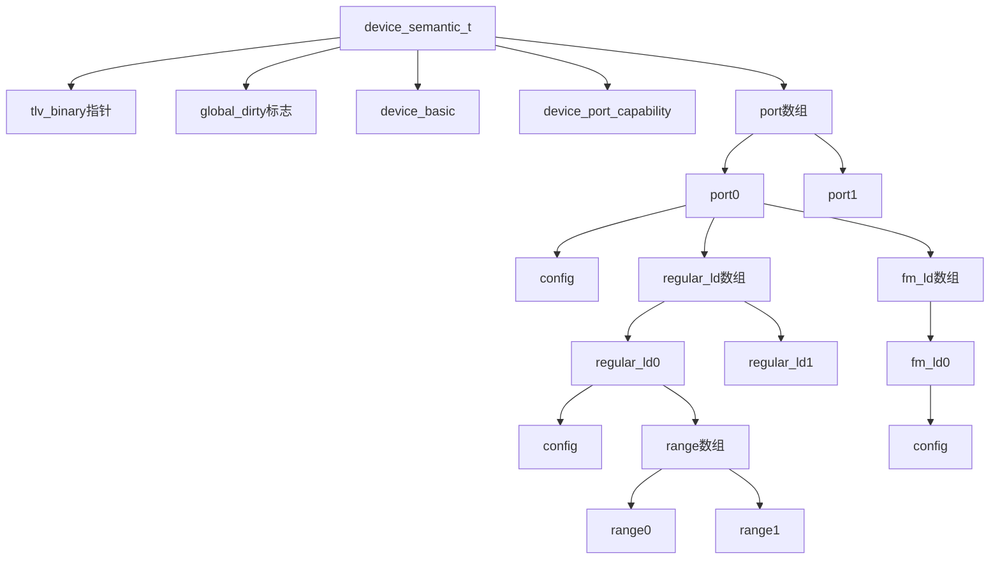
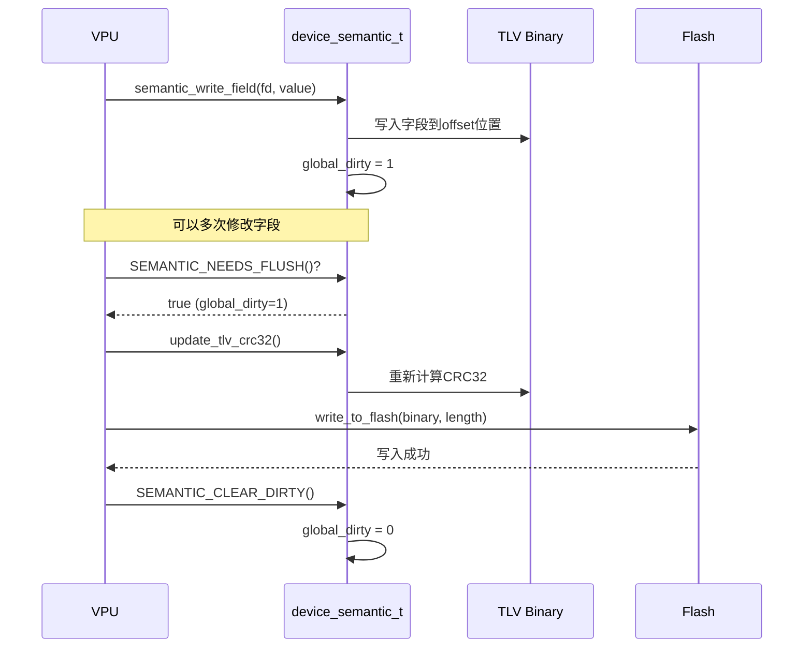

# TLV代码生成目标模型

本文档定义Python代码生成器的目标C代码结构，包括设备语义树的数据结构、通用字段访问接口和实现规范。

## 文档说明

### 目标
定义Python代码生成器要生成的C代码结构，包括：
- 语义树结构体定义（`tlv_semantic.h`）
- 通用字段访问接口
- 解析函数框架（`tlv_parser.h/c`）

### 范围
- 基于 `cfg/tlv_schema.yaml` 的TLV类型定义
- 使用 `cfg/device_config_header.h` 中的常量和枚举
- 实现字段描述符机制，支持通用读写接口
- 支持dirty标记和原地修改

### 与现有文档的关系
- `doc/TLV_Parse_Design.md`：解析流程和语义映射规则
- `doc/tlv_prase_generater.md`：代码生成整体流程和关键代码demo
- 本文档：具体的目标数据结构和接口定义

## 核心设计原则

### 1. 内存优化
- 使用 `uint16_t` 作为offset类型（TLV Binary最大64KB = 2^16）
- 固定容量静态数组，无动态内存分配
- 容量由 `device_config_header.h` 中的宏定义

### 2. 通用字段访问
- 字段描述符（`field_descriptor_t`）统一所有类型的字段访问
- 单一 `semantic_write_field()` 接口处理u8/u16/u32/u64/bool
- 类型安全，自动根据字段类型进行转换

### 3. 修改追踪
- 两级dirty标记机制：
  - 全局级别（`device_semantic_t.global_dirty`）：整个配置是否被修改
  - 节点级别（每个TLV节点的`dirty`字段）：该TLV是否被修改
- 支持VPU动态修改和Flash延迟写入

### 4. 原地修改
- 每个字段保存在Binary中的offset
- 通过 `tlv_binary` 指针直接修改ByteArray
- 修改后可重新计算CRC并写回Flash

## 数据结构定义

### 字段类型枚举

```c
/**
 * @brief TLV字段数据类型枚举
 * 
 * 用于统一处理不同类型字段的读写操作
 */
typedef enum {
    FIELD_TYPE_U8    = 0,    /**< uint8_t / bool (1字节) */
    FIELD_TYPE_U16   = 1,    /**< uint16_t (2字节) */
    FIELD_TYPE_U32   = 2,    /**< uint32_t (4字节) */
    FIELD_TYPE_U64   = 3,    /**< uint64_t (8字节) */
    FIELD_TYPE_BOOL  = 0,    /**< bool类型，等同于U8 */
} field_type_t;

/**
 * @brief 获取字段类型的字节大小
 */
static inline uint8_t field_type_size(field_type_t type)
{
    static const uint8_t sizes[] = {1, 2, 4, 8};
    return (type <= FIELD_TYPE_U64) ? sizes[type] : 0;
}
```

### 字段描述符

```c
/**
 * @brief 字段描述符
 * 
 * 描述一个可修改字段的元数据，用于通用读写接口
 */
typedef struct {
    uint16_t offset;         /**< 字段在Binary中的offset（相对tlv_binary起始） */
    field_type_t type;       /**< 字段类型 */
    uint8_t present;         /**< 字段是否有效（所属TLV是否存在） */
} field_descriptor_t;
```

**说明**：
- `offset`：字段在整个TLV Binary中的绝对偏移（包含Header）
- `type`：字段的数据类型，决定读写时的字节数和解析方式
- `present`：继承自所属TLV节点的present标志，快速判断字段是否可用

### 语义节点结构

#### Device.Basic 节点

对应 `TLV_TYPE_DEVICE_BASIC (0x01)`

```c
typedef struct {
    uint8_t present;                    /**< 是否存在此TLV */
    uint8_t dirty;                      /**< 字段是否被修改 */
    uint16_t tlv_value_offset;          /**< TLV Value起始偏移（相对tlv_binary） */
    uint16_t tlv_length;                /**< TLV Value长度 */
    
    /* 字段值 */
    uint64_t TotalDRAMCapacity;         /**< 总DRAM容量（字节） */
    uint8_t DRAMShareable;              /**< DRAM是否可共享 */
    
    /* 字段描述符（包含offset和type） */
    field_descriptor_t fd_TotalDRAMCapacity;
    field_descriptor_t fd_DRAMShareable;
} device_basic_node_t;
```

#### Device.PortCapability 节点

对应 `TLV_TYPE_DEVICE_PORT_CAPABILITY (0x02)`

```c
typedef struct {
    uint8_t present;                    /**< 是否存在此TLV */
    uint8_t dirty;                      /**< 字段是否被修改 */
    uint16_t tlv_value_offset;          /**< TLV Value起始偏移 */
    uint16_t tlv_length;                /**< TLV Value长度 */
    
    /* 字段值 */
    uint8_t MaxPorts;                   /**< 最大端口数 */
    
    /* 字段描述符 */
    field_descriptor_t fd_MaxPorts;
} device_port_capability_node_t;
```

#### Port.Config 节点

对应 `TLV_TYPE_PORT_CONFIG (0x10)`

```c
typedef struct {
    uint8_t present;                    /**< 是否存在此TLV */
    uint8_t dirty;                      /**< 字段是否被修改 */
    uint16_t tlv_value_offset;          /**< TLV Value起始偏移 */
    uint16_t tlv_length;                /**< TLV Value长度 */
    
    /* 字段值 */
    uint8_t PortID;                     /**< 端口ID */
    uint8_t EnablePort;                 /**< 是否启用端口 */
    uint8_t PCIeSpeed;                  /**< PCIe速度 (pcie_speed_t) */
    uint8_t PCIeWidth;                  /**< PCIe宽度 (pcie_width_t) */
    uint8_t LDMode;                     /**< 逻辑设备模式 (ld_mode_t) */
    
    /* 字段描述符 */
    field_descriptor_t fd_PortID;
    field_descriptor_t fd_EnablePort;
    field_descriptor_t fd_PCIeSpeed;
    field_descriptor_t fd_PCIeWidth;
    field_descriptor_t fd_LDMode;
} port_config_node_t;
```

#### LD.Config 节点

对应 `TLV_TYPE_LD_CONFIG (0x20)`

```c
typedef struct {
    uint8_t present;                    /**< 是否存在此TLV */
    uint8_t dirty;                      /**< 字段是否被修改 */
    uint16_t tlv_value_offset;          /**< TLV Value起始偏移 */
    uint16_t tlv_length;                /**< TLV Value长度 */
    
    /* 字段值 */
    uint8_t PortID;                     /**< 端口ID */
    uint8_t LDID;                       /**< 逻辑设备ID */
    uint8_t LDType;                     /**< 逻辑设备类型 (ld_type_t) */
    uint8_t DOE;                        /**< 是否支持DOE */
    uint8_t SecurityDOE;                /**< 是否支持Security DOE */
    uint8_t Mailbox;                    /**< 是否支持Mailbox */
    
    /* 字段描述符 */
    field_descriptor_t fd_PortID;
    field_descriptor_t fd_LDID;
    field_descriptor_t fd_LDType;
    field_descriptor_t fd_DOE;
    field_descriptor_t fd_SecurityDOE;
    field_descriptor_t fd_Mailbox;
} ld_config_node_t;
```

#### LD.Range 节点

对应 `TLV_TYPE_LD_RANGE (0x30)`

```c
typedef struct {
    uint8_t present;                    /**< 是否存在此TLV */
    uint8_t dirty;                      /**< 字段是否被修改 */
    uint16_t tlv_value_offset;          /**< TLV Value起始偏移 */
    uint16_t tlv_length;                /**< TLV Value长度 */
    
    /* 字段值 */
    uint8_t PortID;                     /**< 端口ID */
    uint8_t LDID;                       /**< 逻辑设备ID */
    uint8_t RangeID;                    /**< 范围ID */
    uint64_t Start_DPA;                 /**< 起始DPA地址 */
    uint64_t Length;                    /**< 长度（字节） */
    uint8_t DCD_Supported;              /**< 是否支持DCD */
    uint8_t ShareModeEnable;            /**< 是否启用共享模式 */
    
    /* 字段描述符 */
    field_descriptor_t fd_PortID;
    field_descriptor_t fd_LDID;
    field_descriptor_t fd_RangeID;
    field_descriptor_t fd_Start_DPA;
    field_descriptor_t fd_Length;
    field_descriptor_t fd_DCD_Supported;
    field_descriptor_t fd_ShareModeEnable;
} ld_range_node_t;
```

### 层级组织结构

```c
/**
 * @brief Regular LD 完整结构（包含Range数组）
 */
typedef struct {
    ld_config_node_t config;                                    /**< LD配置 */
    ld_range_node_t range[MAX_RANGE_PER_REGULAR_LD];           /**< Range数组 */
    uint8_t range_count;                                        /**< 实际Range数量 */
} regular_ld_t;

/**
 * @brief FM LD 完整结构（不包含Range）
 */
typedef struct {
    ld_config_node_t config;                                    /**< LD配置 */
} fm_ld_t;

/**
 * @brief Port 完整结构（包含LD数组）
 */
typedef struct {
    port_config_node_t config;                                  /**< Port配置 */
    
    /* Regular LD数组 */
    regular_ld_t regular_ld[MAX_REGULAR_LD_PER_PORT];          /**< Regular LD数组 */
    uint8_t regular_ld_count;                                   /**< 实际Regular LD数量 */
    
    /* FM LD（MLD模式下使用） */
    fm_ld_t fm_ld[MAX_FM_LD_PER_PORT];                         /**< FM LD数组 */
    uint8_t fm_ld_count;                                        /**< 实际FM LD数量 */
} port_t;

/**
 * @brief 设备完整语义结构
 * 
 * 这是从平铺TLV解析后的树形结构，包含：
 * - Device级别信息
 * - Port数组（每个Port包含LD数组）
 * - 每个Regular LD包含Range数组
 * 
 * 所有字段offset支持原地修改ByteArray。
 */
typedef struct {
    /* TLV Binary指针和状态 */
    uint8_t *tlv_binary;                                        /**< 指向TLV Binary起始地址（含Header） */
    uint16_t tlv_binary_length;                                 /**< TLV Binary总长度（含Header） */
    uint8_t global_dirty;                                       /**< 全局dirty标志：0=未修改，1=已修改待写入Flash */
    
    /* Device级别节点 */
    device_basic_node_t device_basic;                           /**< 设备基本信息 */
    device_port_capability_node_t device_port_capability;       /**< 设备端口能力 */
    
    /* Port数组 */
    port_t port[MAX_PORTS];                                     /**< Port数组 */
    uint8_t port_count;                                         /**< 实际Port数量 */
    
    /* 解析状态 */
    uint8_t parse_success;                                      /**< 解析是否成功 */
    uint16_t total_tlv_count;                                   /**< 总TLV数量 */
} device_semantic_t;
```

### 语义树层级关系图



## 通用接口定义

### 字段读写接口

#### semantic_write_field()

```c
/**
 * @brief 通用字段写入函数
 * 
 * 根据字段描述符自动选择正确的写入方法
 * 
 * @param sem 语义结构指针
 * @param fd 字段描述符
 * @param value 要写入的值（64位，会根据类型截断）
 * @return 0=成功，-1=失败
 */
static inline int semantic_write_field(device_semantic_t *sem, 
                                       const field_descriptor_t *fd, 
                                       uint64_t value)
{
    if (!sem || !fd || !fd->present || !sem->tlv_binary) {
        return -1;
    }
    
    uint16_t offset = fd->offset;
    uint8_t size = field_type_size(fd->type);
    
    if (offset + size > sem->tlv_binary_length) {
        return -1;
    }
    
    uint8_t *ptr = sem->tlv_binary + offset;
    
    switch (fd->type) {
        case FIELD_TYPE_U8:
        case FIELD_TYPE_BOOL:
            *ptr = (uint8_t)value;
            break;
            
        case FIELD_TYPE_U16:
            ptr[0] = value & 0xFF;
            ptr[1] = (value >> 8) & 0xFF;
            break;
            
        case FIELD_TYPE_U32:
            ptr[0] = value & 0xFF;
            ptr[1] = (value >> 8) & 0xFF;
            ptr[2] = (value >> 16) & 0xFF;
            ptr[3] = (value >> 24) & 0xFF;
            break;
            
        case FIELD_TYPE_U64:
            for (int i = 0; i < 8; i++) {
                ptr[i] = (value >> (i * 8)) & 0xFF;
            }
            break;
            
        default:
            return -1;
    }
    
    sem->global_dirty = 1;
    return 0;
}
```

#### semantic_read_field()

```c
/**
 * @brief 通用字段读取函数
 * 
 * 根据字段描述符自动选择正确的读取方法
 * 
 * @param sem 语义结构指针
 * @param fd 字段描述符
 * @param value 输出参数，读取的值
 * @return 0=成功，-1=失败
 */
static inline int semantic_read_field(const device_semantic_t *sem, 
                                      const field_descriptor_t *fd, 
                                      uint64_t *value)
{
    if (!sem || !fd || !fd->present || !sem->tlv_binary || !value) {
        return -1;
    }
    
    uint16_t offset = fd->offset;
    uint8_t size = field_type_size(fd->type);
    
    if (offset + size > sem->tlv_binary_length) {
        return -1;
    }
    
    const uint8_t *ptr = sem->tlv_binary + offset;
    *value = 0;
    
    switch (fd->type) {
        case FIELD_TYPE_U8:
        case FIELD_TYPE_BOOL:
            *value = *ptr;
            break;
            
        case FIELD_TYPE_U16:
            *value = ptr[0] | ((uint16_t)ptr[1] << 8);
            break;
            
        case FIELD_TYPE_U32:
            *value = ptr[0] | ((uint32_t)ptr[1] << 8) | 
                    ((uint32_t)ptr[2] << 16) | ((uint32_t)ptr[3] << 24);
            break;
            
        case FIELD_TYPE_U64:
            for (int i = 0; i < 8; i++) {
                *value |= ((uint64_t)ptr[i]) << (i * 8);
            }
            break;
            
        default:
            return -1;
    }
    
    return 0;
}
```

### 辅助宏定义

```c
/**
 * 初始化语义结构（清零所有present标志）
 */
#define SEMANTIC_INIT(sem) \
    do { \
        memset((sem), 0, sizeof(device_semantic_t)); \
    } while(0)

/**
 * 标记全局dirty（任何字段被修改后调用）
 */
#define SEMANTIC_MARK_DIRTY(sem) \
    do { \
        (sem)->global_dirty = 1; \
    } while(0)

/**
 * 清除全局dirty（写入Flash后调用）
 */
#define SEMANTIC_CLEAR_DIRTY(sem) \
    do { \
        (sem)->global_dirty = 0; \
    } while(0)

/**
 * 检查是否需要写入Flash
 */
#define SEMANTIC_NEEDS_FLUSH(sem) ((sem)->global_dirty)

/**
 * 检查Device.Basic是否存在
 */
#define HAS_DEVICE_BASIC(sem) ((sem)->device_basic.present)

/**
 * 检查指定Port是否存在
 */
#define HAS_PORT(sem, port_id) \
    ((port_id) < MAX_PORTS && (sem)->port[port_id].config.present)

/**
 * 检查指定Port的指定Regular LD是否存在
 */
#define HAS_REGULAR_LD(sem, port_id, ld_id) \
    (HAS_PORT(sem, port_id) && \
     (ld_id) < MAX_REGULAR_LD_PER_PORT && \
     (sem)->port[port_id].regular_ld[ld_id].config.present)

/**
 * 检查指定Port的指定Regular LD的指定Range是否存在
 */
#define HAS_RANGE(sem, port_id, ld_id, range_id) \
    (HAS_REGULAR_LD(sem, port_id, ld_id) && \
     (range_id) < MAX_RANGE_PER_REGULAR_LD && \
     (sem)->port[port_id].regular_ld[ld_id].range[range_id].present)

/**
 * 检查指定Port的FM LD是否存在
 */
#define HAS_FM_LD(sem, port_id, fm_id) \
    (HAS_PORT(sem, port_id) && \
     (fm_id) < MAX_FM_LD_PER_PORT && \
     (sem)->port[port_id].fm_ld[fm_id].config.present)

/**
 * 标记节点dirty（用于跟踪哪些TLV被修改）
 */
#define MARK_NODE_DIRTY(node) \
    do { \
        (node)->dirty = 1; \
    } while(0)

/**
 * 清除节点dirty
 */
#define CLEAR_NODE_DIRTY(node) \
    do { \
        (node)->dirty = 0; \
    } while(0)
```

## Python生成器指导

### 类型映射表

Python生成器需要将 `tlv_schema.yaml` 中的类型映射到 `field_type_t`：

```python
# 类型映射表
TYPE_MAPPING = {
    'u8': 'FIELD_TYPE_U8',
    'u16': 'FIELD_TYPE_U16',
    'u32': 'FIELD_TYPE_U32',
    'u64': 'FIELD_TYPE_U64',
    'bool': 'FIELD_TYPE_BOOL',
}

# 类型大小映射
TYPE_SIZE = {
    'u8': 1,
    'u16': 2,
    'u32': 4,
    'u64': 8,
    'bool': 1,
}
```

### 生成节点结构体

对于每个TLV类型（如 `Port.Config`），生成器需要：

1. **生成结构体定义**：

```python
def generate_node_struct(tlv_name, tlv_schema):
    """生成TLV节点结构体定义"""
    struct_name = tlv_name.lower().replace('.', '_') + '_node_t'
    fields = tlv_schema['fields']
    
    # 生成结构体头部
    output = f"typedef struct {{\n"
    output += "    uint8_t present;\n"
    output += "    uint8_t dirty;\n"
    output += "    uint16_t tlv_value_offset;\n"
    output += "    uint16_t tlv_length;\n\n"
    
    # 生成字段值
    output += "    /* 字段值 */\n"
    for field in fields:
        c_type = get_c_type(field['type'])
        output += f"    {c_type} {field['name']};\n"
    
    # 生成字段描述符
    output += "\n    /* 字段描述符 */\n"
    for field in fields:
        output += f"    field_descriptor_t fd_{field['name']};\n"
    
    output += f"}} {struct_name};\n"
    return output
```

2. **生成字段映射函数**：

```python
def generate_map_function(tlv_name, tlv_schema):
    """生成TLV字段映射函数"""
    func_name = f"map_{tlv_name.lower().replace('.', '_')}"
    fields = tlv_schema['fields']
    
    output = f"static void {func_name}(const uint8_t* buf,\n"
    output += f"                       const tlv_index_t* idx,\n"
    output += f"                       device_semantic_t* sem)\n"
    output += "{\n"
    output += "    const uint8_t* v = buf + idx->value_offset;\n"
    output += "    uint16_t base = idx->value_offset;\n\n"
    
    # 根据TLV类型确定如何定位节点（通过PortID/LDID等）
    # 这里以Port.Config为例
    output += "    uint8_t port_id = v[0];\n"
    output += "    if (port_id < MAX_PORTS) {\n"
    output += "        port_config_node_t* p = &sem->port[port_id].config;\n"
    output += "        p->present = 1;\n"
    output += "        p->tlv_value_offset = idx->value_offset;\n"
    output += "        p->tlv_length = idx->length;\n\n"
    
    # 读取字段值
    output += "        /* 读取字段值 */\n"
    offset = 0
    for field in fields:
        output += f"        p->{field['name']} = "
        output += generate_field_read(field, offset)
        offset += TYPE_SIZE[field['type']]
    
    # 初始化字段描述符
    output += "\n        /* 初始化字段描述符 */\n"
    offset = 0
    for field in fields:
        output += f"        p->fd_{field['name']} = (field_descriptor_t){{\n"
        output += f"            .offset = base + {offset},\n"
        output += f"            .type = {TYPE_MAPPING[field['type']]},\n"
        output += f"            .present = 1\n"
        output += f"        }};\n"
        offset += TYPE_SIZE[field['type']]
    
    output += "    }\n"
    output += "}\n"
    return output
```

### 字段描述符初始化模板

对于每个字段，生成器需要生成初始化代码：

```python
def generate_field_descriptor_init(field_name, offset, field_type):
    """生成字段描述符初始化代码"""
    return f"""        p->fd_{field_name} = (field_descriptor_t){{
            .offset = base + {offset},
            .type = {TYPE_MAPPING[field_type]},
            .present = 1
        }};"""
```

### 解析函数生成要点

主解析函数框架：

```c
int parse_tlv_binary(device_semantic_t *sem, uint8_t *binary, uint16_t length)
{
    SEMANTIC_INIT(sem);
    sem->tlv_binary = binary;
    sem->tlv_binary_length = length;
    
    // 1. 解析Header并校验
    if (length < sizeof(binary_tlv_header_t)) {
        return -1;
    }
    
    // 2. 构建TLV索引
    tlv_index_t index[MAX_TLV_COUNT];
    uint16_t index_count = 0;
    build_tlv_index(binary, length, index, &index_count, MAX_TLV_COUNT);
    
    // 3. 遍历索引，调用对应的映射函数
    for (uint16_t i = 0; i < index_count; i++) {
        switch (index[i].type) {
            case TLV_TYPE_DEVICE_BASIC:
                map_device_basic(binary, &index[i], sem);
                break;
            case TLV_TYPE_PORT_CONFIG:
                map_port_config(binary, &index[i], sem);
                break;
            // ... 其他类型
        }
    }
    
    sem->parse_success = 1;
    sem->total_tlv_count = index_count;
    return 0;
}
```

## 使用示例

### 基本读写操作

```c
/* 初始化 */
device_semantic_t sem;
uint8_t flash_buffer[8192];
uint16_t flash_size = read_from_flash(flash_buffer, sizeof(flash_buffer));

/* 解析 */
parse_tlv_binary(&sem, flash_buffer, flash_size);

/* 读取字段 */
if (HAS_PORT(&sem, 0)) {
    uint64_t value;
    port_config_node_t *port0 = &sem.port[0].config;
    
    if (semantic_read_field(&sem, &port0->fd_PCIeSpeed, &value) == 0) {
        printf("Port0 PCIe Speed: Gen%d\n", (uint8_t)value);
    }
}

/* 修改字段 */
semantic_write_field(&sem, &sem.port[0].config.fd_LDMode, LD_MODE_MLD);
MARK_NODE_DIRTY(&sem.port[0].config);

/* 检查是否需要写Flash */
if (SEMANTIC_NEEDS_FLUSH(&sem)) {
    // 重新计算CRC
    update_tlv_crc32(&sem);
    
    // 写入Flash
    write_to_flash(sem.tlv_binary, sem.tlv_binary_length);
    
    // 清除dirty标志
    SEMANTIC_CLEAR_DIRTY(&sem);
}
```

### VPU批量修改

```c
/* 定义批量更新结构 */
typedef struct {
    field_descriptor_t *fd;
    uint64_t value;
} field_update_t;

/* 批量更新函数 */
void vpu_batch_update(device_semantic_t *sem, 
                      field_update_t *updates, 
                      int count)
{
    for (int i = 0; i < count; i++) {
        semantic_write_field(sem, updates[i].fd, updates[i].value);
    }
}

/* 使用示例 */
field_update_t updates[] = {
    {&sem.port[0].config.fd_LDMode, LD_MODE_MLD},
    {&sem.port[0].config.fd_PCIeSpeed, PCIE_SPEED_GEN5},
    {&sem.port[0].config.fd_EnablePort, 1},
};
vpu_batch_update(&sem, updates, 3);
```

### Dirty标记和Flash写入流程



## 内存占用估算

基于 `device_config_header.h` 中的定义：
- `MAX_PORTS = 2`
- `MAX_REGULAR_LD_PER_PORT = 4`
- `MAX_FM_LD_PER_PORT = 1`
- `MAX_RANGE_PER_REGULAR_LD = 2`

### 各结构体大小

```
field_descriptor_t:
  - offset (u16):     2 bytes
  - type (u8):        1 byte
  - present (u8):     1 byte
  Total:              4 bytes

device_basic_node_t:
  - present/dirty:    2 bytes
  - tlv offsets:      6 bytes
  - TotalDRAMCapacity: 8 bytes
  - DRAMShareable:    1 byte
  - 2 field_descriptor_t: 8 bytes
  Total:              ~25 bytes

device_port_capability_node_t:
  - present/dirty:    2 bytes
  - tlv offsets:      6 bytes
  - MaxPorts:         1 byte
  - 1 field_descriptor_t: 4 bytes
  Total:              ~13 bytes

port_config_node_t:
  - present/dirty:    2 bytes
  - tlv offsets:      6 bytes
  - 5 fields:         5 bytes
  - 5 field_descriptor_t: 20 bytes
  Total:              ~33 bytes

ld_config_node_t:
  - present/dirty:    2 bytes
  - tlv offsets:      6 bytes
  - 6 fields:         6 bytes
  - 6 field_descriptor_t: 24 bytes
  Total:              ~38 bytes

ld_range_node_t:
  - present/dirty:    2 bytes
  - tlv offsets:      6 bytes
  - 7 fields:         20 bytes (含2个u64)
  - 7 field_descriptor_t: 28 bytes
  Total:              ~56 bytes

regular_ld_t:
  - config:           38 bytes
  - range[2]:         112 bytes
  - range_count:      1 byte
  Total:              ~151 bytes

fm_ld_t:
  - config:           38 bytes
  Total:              ~38 bytes

port_t:
  - config:           33 bytes
  - regular_ld[4]:    604 bytes
  - regular_ld_count: 1 byte
  - fm_ld[1]:         38 bytes
  - fm_ld_count:      1 byte
  Total:              ~677 bytes

device_semantic_t:
  - tlv_binary ptr:   8 bytes (64位系统)
  - tlv_binary_length: 2 bytes
  - global_dirty:     1 byte
  - device_basic:     25 bytes
  - device_port_cap:  13 bytes
  - port[2]:          1354 bytes
  - port_count:       1 byte
  - parse_success:    1 byte
  - total_tlv_count:  2 bytes
  Total:              ~1407 bytes
```

**总内存占用约 1.4KB**，非常适合嵌入式固件使用。

## 生成文件组织

Python生成器应生成以下文件：

### generated/tlv_semantic.h
- 字段类型枚举（`field_type_t`）
- 字段描述符（`field_descriptor_t`）
- 所有TLV节点结构体
- 层级组织结构（`regular_ld_t`, `fm_ld_t`, `port_t`, `device_semantic_t`）
- 辅助宏定义

### generated/tlv_parser.h
- 解析API声明
- 通用字段读写接口（`semantic_write_field`, `semantic_read_field`）
- TLV索引结构（`tlv_index_t`）

### generated/tlv_parser.c
- TLV索引构建函数（`build_tlv_index`）
- 各TLV类型的映射函数（`map_device_basic`, `map_port_config`等）
- 主解析函数（`parse_tlv_binary`）
- CRC更新函数（`update_tlv_crc32`）

### 可选：generated/tlv_offsets.h
- 字段offset宏定义（用于调试或特殊场景）

## 兼容性考虑

### 前向兼容
- 使用 `tlv_length` 判断字段可用范围
- 新增字段放在TLV尾部，旧固件忽略超出部分
- 不识别的TLV类型直接跳过

### 版本管理
- 通过Header中的 `schema_version` 识别版本
- 生成器可根据版本生成不同的结构体

### 扩展建议
- 通过 `cfg/tlv_schema.yaml` 扩展TLV类型
- 无需手改C逻辑，重新运行生成器即可

## 与现有设计文档的关系

- **`doc/TLV_Parse_Design.md`**：定义了平铺TLV的解析流程和语义映射规则，本文档是其C代码实现规范
- **`doc/tlv_prase_generater.md`**：描述了代码生成的整体流程和关键demo，本文档是其目标数据结构定义
- **本文档**：作为Python生成器的参考规范，定义了要生成的完整C代码结构

三个文档共同构成了从设计到实现的完整链路。

