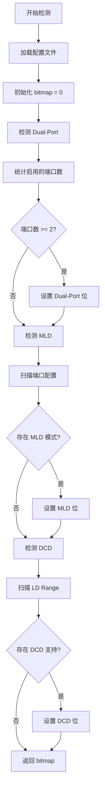

# Feature Bitmap 自动检测说明

## 概述

Feature Bitmap 是二进制 TLV 文件头中的一个 32 位字段，用于标识硬件设备支持的特性。为了避免手动维护这个字段，本工具实现了自动检测功能，能够根据配置文件内容自动分析并生成正确的 feature_bitmap 值。

## Feature Bitmap 的作用

Feature Bitmap 允许固件在运行时快速判断设备支持哪些硬件特性，而无需解析整个 TLV 配置。这对于以下场景特别有用：

- **快速特性检查**：固件启动时快速判断是否支持某个特性
- **条件初始化**：根据特性位选择性地初始化相关硬件模块
- **兼容性判断**：验证配置文件与硬件的兼容性
- **调试信息**：在日志中快速显示设备支持的特性

## 自动检测逻辑

`feature_detector.py` 模块实现了自动检测逻辑，通过分析配置文件中的 TLV 配置项来确定哪些特性被启用。

### 检测规则

#### 1. Dual-Port (双端口)

**定义**：设备支持两个或更多 PCIe 端口

**检测规则**：
- 统计配置文件中 `Type: Port.Config` 且 `Enable: true` 的配置项数量
- 如果数量 ≥ 2，则认为启用了 Dual-Port 特性

**示例**：
```yaml
- Type: Port.Config
  Enable: true
  Value:
    PortID: 0
    # ... 其他配置 ...

- Type: Port.Config
  Enable: true
  Value:
    PortID: 1
    # ... 其他配置 ...
```

上述配置会触发 Dual-Port 特性检测。

#### 2. MLD (Multi-Logical Device)

**定义**：端口支持多逻辑设备模式

**检测规则**：
- 遍历所有 `Type: Port.Config` 且 `Enable: true` 的配置项
- 检查其 `Value.LDMode` 字段
- 如果任意一个端口的 `LDMode` 为 `LD_MODE_MLD`，则认为启用了 MLD 特性

**示例**：
```yaml
- Type: Port.Config
  Enable: true
  Value:
    PortID: 0
    LDMode: LD_MODE_MLD    # 触发 MLD 检测
    # ... 其他配置 ...
```

**注意**：`LD_MODE_MLD` 是在 `cfg/device_config_header.h` 中定义的枚举值。

#### 3. DCD (Dynamic Capacity Device)

**定义**：逻辑设备支持动态容量

**检测规则**：
- 遍历所有 `Type: LD.Range` 且 `Enable: true` 的配置项
- 检查其 `Value.DCD_Supported` 字段
- 如果任意一个 LD Range 的 `DCD_Supported` 为 `true`，则认为启用了 DCD 特性

**示例**：
```yaml
- Type: LD.Range
  Enable: true
  Value:
    PortID: 0
    LDID: 1
    DCD_Supported: true    # 触发 DCD 检测
    # ... 其他配置 ...
```

### 检测流程



## 使用方法

### 自动检测（默认行为）

从版本 X.X 开始，工具默认启用自动检测功能。转换时无需指定 feature_bitmap，工具会自动分析配置并设置：

```bash
python yaml_to_binary.py -i cfg/deviceCfg.yaml -o output/device_config.bin
```

在 verbose 模式下，可以看到检测结果：

```bash
python yaml_to_binary.py -i cfg/deviceCfg.yaml -o output/device_config.bin -v
```

输出示例：
```
开始检测 Feature Bitmap...
  ✓ Dual-Port 特性检测到 (掩码: 0x00000001)
  ✓ MLD 特性检测到 (掩码: 0x00000002)
  ✓ DCD 特性检测到 (掩码: 0x00000004)

自动检测到的 Feature Bitmap: 0x00000007
启用的特性: Dual-Port, MLD, DCD
```

### 手动覆盖

如果需要手动指定 feature_bitmap（例如用于测试），可以使用 `--feature-bitmap` 选项：

```bash
python yaml_to_binary.py -i cfg/deviceCfg.yaml -o output/device_config.bin --feature-bitmap 0x00000003
```

**注意**：手动指定的值会覆盖自动检测结果。

### 禁用自动检测

如果希望使用默认的 feature_bitmap（在 `device_config_header.h` 中定义），可以使用 `--no-auto-detect` 选项：

```bash
python yaml_to_binary.py -i cfg/deviceCfg.yaml -o output/device_config.bin --no-auto-detect
```

## 配置文件耦合关系

### 重要提示

**此模块与配置文件结构紧密耦合。** 如果修改了以下内容，需要同步更新 `feature_detector.py`：

### 依赖的 TLV 类型

| TLV 类型 | 用途 | 检测的特性 |
|---------|------|-----------|
| `Port.Config` | 端口配置 | Dual-Port, MLD |
| `LD.Range` | 逻辑设备范围 | DCD |

### 依赖的字段

| 字段名 | 所属 TLV | 数据类型 | 用途 |
|-------|---------|---------|------|
| `Enable` | 所有 TLV | Boolean | 判断配置项是否启用 |
| `LDMode` | Port.Config | Enum (String) | 判断端口是否使用 MLD 模式 |
| `DCD_Supported` | LD.Range | Boolean | 判断 LD Range 是否支持 DCD |

### 依赖的枚举值

| 枚举名 | 定义位置 | 用途 |
|-------|---------|------|
| `LD_MODE_MLD` | `cfg/device_config_header.h` | 标识 MLD 模式 |
| `LD_MODE_SLD` | `cfg/device_config_header.h` | 标识 SLD 模式（对比用） |

### 依赖的 Feature Mask

| Mask 名称 | 定义位置 | Bit 位 |
|----------|---------|--------|
| `FEATURE_MASK_DUAL_PORT` | `cfg/device_config_header.h` | Bit 0 |
| `FEATURE_MASK_MLD` | `cfg/device_config_header.h` | Bit 1 |
| `FEATURE_MASK_DCD` | `cfg/device_config_header.h` | Bit 2 |

## 维护指南

### 添加新特性检测

如果需要添加新的特性检测，请按以下步骤操作：

1. **更新 C 头文件** (`cfg/device_config_header.h`)
   ```c
   #define FEATURE_BIT_NEW_FEATURE  3
   #define FEATURE_MASK_NEW_FEATURE (1U << FEATURE_BIT_NEW_FEATURE)
   ```

2. **更新检测器** (`utilities/yaml_to_tlvbinary/feature_detector.py`)
   ```python
   def _detect_new_feature(self, config_list: List[dict]) -> bool:
       """检测新特性
       
       规则：描述检测规则
       """
       # 实现检测逻辑
       pass
   
   def detect_features(self, config_list: List[dict], verbose: bool = False):
       # ... 现有代码 ...
       
       # 添加新特性检测
       new_feature_detected = self._detect_new_feature(config_list)
       results['NewFeature'] = new_feature_detected
       if new_feature_detected:
           mask = self.header_parser.get('FEATURE_MASK_NEW_FEATURE')
           bitmap |= mask
           if verbose:
               print(f"  ✓ NewFeature 特性检测到 (掩码: 0x{mask:08X})")
       
       return bitmap, results
   ```

3. **更新文档**
   - 在本文档中添加新特性的检测规则说明
   - 更新依赖关系表格

4. **添加测试用例**
   - 创建包含新特性的测试配置
   - 验证检测逻辑正确性

### 修改现有检测规则

如果需要修改现有特性的检测规则：

1. 更新 `feature_detector.py` 中对应的 `_detect_*` 方法
2. 更新本文档中的检测规则说明
3. 更新测试用例以反映新规则
4. 在 CHANGELOG 中记录变更

## 测试

### 单独测试检测器

可以直接运行 `feature_detector.py` 来测试检测逻辑：

```bash
cd utilities/yaml_to_tlvbinary
python feature_detector.py
```

这将加载 `cfg/deviceCfg.yaml` 并输出检测结果。

### 集成测试

使用不同的配置文件测试各种场景：

```bash
# 测试单端口配置
python yaml_to_binary.py -i test_configs/single_port.yaml -o output/test.bin -v

# 测试双端口配置
python yaml_to_binary.py -i test_configs/dual_port.yaml -o output/test.bin -v

# 测试 MLD 配置
python yaml_to_binary.py -i test_configs/mld_config.yaml -o output/test.bin -v

# 测试 DCD 配置
python yaml_to_binary.py -i test_configs/dcd_config.yaml -o output/test.bin -v
```

## 常见问题

### Q: 为什么我的特性没有被检测到？

**A**: 请检查以下几点：
1. 相关的配置项 `Enable` 字段是否为 `true`
2. 字段名称是否正确（区分大小写）
3. 枚举值是否与 `device_config_header.h` 中定义的一致
4. 使用 `-v` 选项查看详细的检测过程

### Q: 可以禁用某个特性的自动检测吗？

**A**: 目前不支持选择性禁用某个特性的检测。如果需要自定义 feature_bitmap，请使用 `--feature-bitmap` 选项手动指定完整的值。

### Q: 自动检测会影响性能吗？

**A**: 检测过程非常快速（通常 < 1ms），因为只需要遍历配置列表并检查特定字段。对整体转换性能的影响可以忽略不计。

### Q: 如果配置文件格式变化了怎么办？

**A**: 如果 TLV 类型名称、字段名称或枚举值发生变化，需要同步更新 `feature_detector.py`。建议在修改配置文件格式时，同时更新检测器并运行测试用例。

## 相关文件

- `cfg/device_config_header.h` - Feature Bitmap 位定义
- `utilities/yaml_to_tlvbinary/feature_detector.py` - 检测器实现
- `utilities/yaml_to_tlvbinary/header_config_parser.py` - C 头文件解析器
- `utilities/yaml_to_tlvbinary/yaml_to_binary.py` - 主转换工具
- `cfg/deviceCfg.yaml` - 配置文件示例

## 版本历史

- **v1.0** (2026-01-28)
  - 初始实现
  - 支持 Dual-Port、MLD、DCD 三个特性的自动检测
  - 提供 verbose 模式输出检测详情

